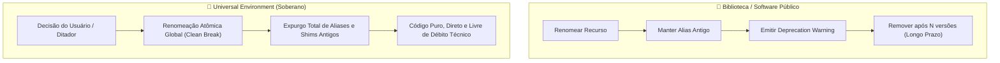

# ⚡ Clean-Break Refactoring — Refatoração Soberana Sem Legado

> _"Perfection is achieved, not when there is nothing more to add, but when there is nothing left to take away."_ 
> — Antoine de Saint-Exupéry, _Terre des hommes_ (1939)

Esta skill estabelece as diretrizes de refatoração para o ecossistema **Universal Environment**. Ao contrário de bibliotecas públicas ou plataformas corporativas com milhares de consumidores anônimos, este ecossistema é estritamente **pessoal, monousuário e governado por um único desenvolvedor soberano (Gabriel Frigo)**.

Em projetos com esta arquitetura de governança, introduzir shims de retrocompatibilidade, aliases de transição ou variáveis legadas é classificado como **débito técnico artificial e poluição de código** (_cruft_).

---

## 🏛️ O Princípio da Soberania Monousuário

Em ambientes corporativos ou bibliotecas públicas (`semver`), a quebra de compatibilidade exige ciclos de depreciação, warnings em runtime e shims temporários. No **Universal Environment**, essa premissa é expressamente rejeitada:

---

## ⚖️ Matriz de Decisão: Quando Manter vs. Quando Expurgar

| Dimensão                  | Software Multi-Usuário / Biblioteca Pública | Universal Environment (Este Ecossistema)                          |
| :------------------------ | :------------------------------------------ | :---------------------------------------------------------------- |
| **Público-Alvo**          | Terceiros desconhecidos                     | Único usuário (Gabriel Frigo)                                     |
| **Custo do Shim**         | Justificável para evitar incidentes         | Inaceitável: polui o shell, duplica manutenção e gera ambiguidade |
| **Aliases de Transição**  | Recomendados por N ciclos de release        | **Terminantemente proibidos**                                     |
| **Variáveis Antigas**     | Fallback mantido por compatibilidade        | **Expurgadas sumariamente**                                       |
| **Comentários de Código** | "Deprecated: use Y instead"                 | **Proibidos**: nada de comentários tipo `(antigo X)`              |
| **Ação do Agente**        | Criar compatibilidade retroativa preventiva | **Executar clean break imediato e definitivo**                    |

---

## 📋 Checklist Operacional do Clean Break

Ao receber um comando de renomeação ou reestruturação de recursos no ecossistema (servidores, ferramentas, variáveis, diretórios, receitas):

1. **Expurgo de Variáveis de Ambiente:**
    - Atualizar a variável canônica em todos os arquivos de configuração (`hosts.env`, scripts, loaders).
    - **NÃO** manter linhas de aliases legados como `VAR_ANTIGA="${VAR_NOVA}"`.
    - **NÃO** usar fallbacks silenciosos em cascata para nomes antigos (`${VAR_NOVA:-${VAR_ANTIGA}}`). Apenas `${VAR_NOVA:-default}`.

2. **Expurgo de Funções e Aliases de Terminal:**
    - Declarar apenas o novo comando nas shells suportadas (POSIX `sh`, Bash, Zsh, PowerShell, NuShell, Clink).
    - **NÃO** criar `alias comando-antigo=comando-novo` ou wrappers de compatibilidade.

3. **Arquivos e Chaves Criptográficas:**
    - Renomear via `git mv` os artefatos correspondentes no repositório canônico (`Vault/keys/`).
    - Atualizar a resolução dinâmica para procurar estritamente o novo nome de arquivo.
    - Limpar arquivos antigos nos diretórios de runtime (`~/.local/share/vault/keys/`).

4. **Diretórios de Infraestrutura e Receitas:**
    - Renomear diretórios com `git mv` (ex: `oracle-personal/`, `oracle-venture/`).
    - Atualizar documentação e chamadas `curl` para apontar diretamente para a nova rota.
    - **NÃO** deixar notas como `(antigo xpto)` no corpo de documentações executáveis.

5. **Auditoria Pós-Expurgo:**
    - Executar busca com `rg` em toda a árvore para assegurar zero correspondências do identificador obsoleto.
    - Executar `make audit` para garantir integridade e 100% de aprovação nos testes estáticos.
