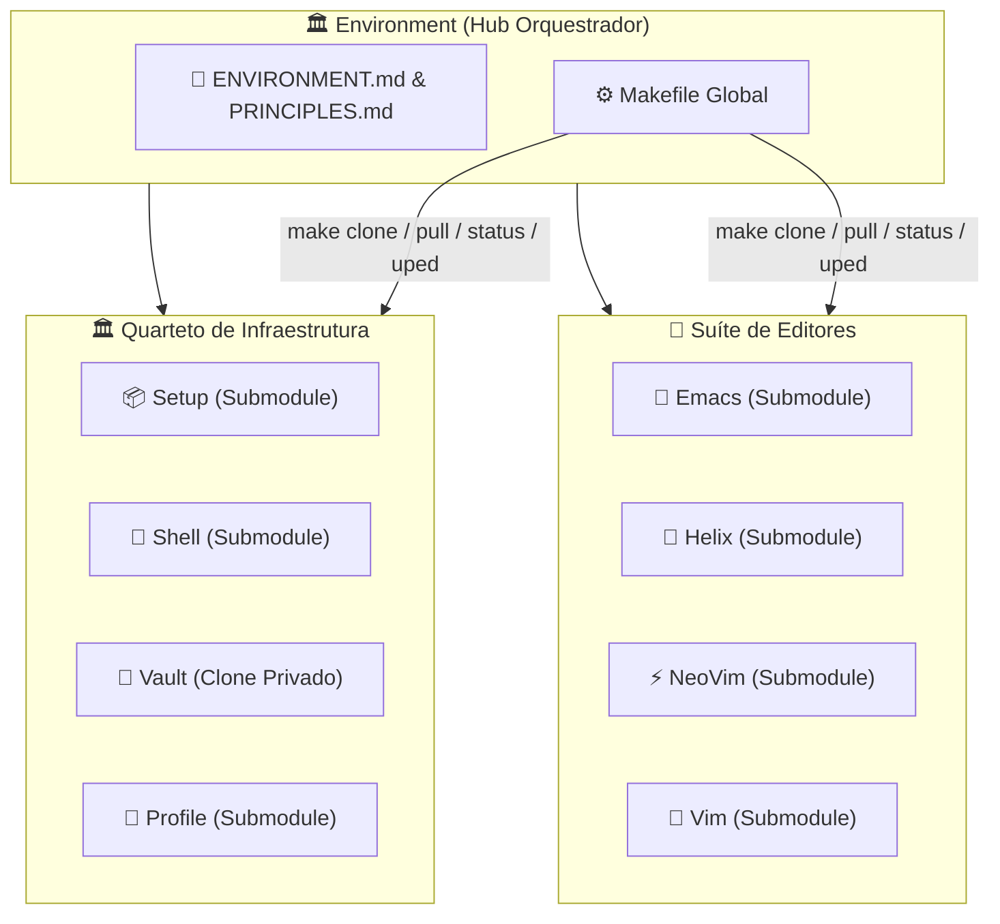

# 🏛️ Universal Environment

> Hub orquestrador do **Quarteto de Produtividade** — ponto de entrada unificado para provisionamento, personalização e operação de estações de trabalho em Linux, FreeBSD e Windows.

---

### 🏛️ O Quarteto de Infraestrutura

[](https://github.com/GabrielFrigo4/setup)
[](https://github.com/GabrielFrigo4/shell)
[](https://github.com/GabrielFrigo4/vault)
[](https://github.com/GabrielFrigo4/profile)

### 📝 A Suíte de Editores

[](https://github.com/GabrielFrigo4/emacs)
[](https://github.com/GabrielFrigo4/helix)
[](https://github.com/GabrielFrigo4/neovim)
[](https://github.com/GabrielFrigo4/vim)

> 📖 **Arquitetura Unificada do Ecossistema:** Conheça a matriz completa de responsabilidades, ciclo de boot e segregação de privilégios em [ENVIRONMENT.md](ENVIRONMENT.md).
> 📜 **Princípios de Engenharia:** Conheça os 18 princípios UNIX e boas práticas Clean Code em [PRINCIPLES.md](PRINCIPLES.md).

---

## 🧠 O que é o Environment?

O **Environment** é o **repositório raiz** que centraliza e orquestra os 4 componentes do Quarteto de Produtividade e os 4 repositórios da Suíte de Editores. Ele não é um monorepo — cada componente mantém seu próprio repositório Git independente. O Environment funciona como:

1. **Ponto de Entrada Único:** Clone este repositório e tenha acesso imediato a todo o ecossistema via `make clone`.
2. **Orquestrador de Operações:** Comandos globais (`make status`, `make pull`, `make uped`, `make audit`, `make ci`) operam simultaneamente em todo o ecossistema.
3. **Fonte Canônica de Documentação:** O [ENVIRONMENT.md](ENVIRONMENT.md) e [PRINCIPLES.md](PRINCIPLES.md) nesta raiz são as versões autoritativas do ecossistema.



---

## 📋 Arquitetura Híbrida (Submodules + Clone Privado)

| Repositório                                             | Tipo          | Visibilidade | Mecanismo                                     |
| :------------------------------------------------------ | :------------ | :----------- | :-------------------------------------------- |
| **[Setup](https://github.com/GabrielFrigo4/setup)**     | Git Submodule | 🟢 Público   | `git submodule update --init`                 |
| **[Shell](https://github.com/GabrielFrigo4/shell)**     | Git Submodule | 🟢 Público   | `git submodule update --init`                 |
| **[Profile](https://github.com/GabrielFrigo4/profile)** | Git Submodule | 🟢 Público   | `git submodule update --init`                 |
| **[Vault](https://github.com/GabrielFrigo4/vault)**     | Clone Privado | 🔴 Privado   | `git clone` via SSH (requer chave autorizada) |
| **[Emacs](https://github.com/GabrielFrigo4/emacs)**     | Git Submodule | 🟢 Público   | `git submodule update --init`                 |
| **[Helix](https://github.com/GabrielFrigo4/helix)**     | Git Submodule | 🟢 Público   | `git submodule update --init`                 |
| **[NeoVim](https://github.com/GabrielFrigo4/neovim)**   | Git Submodule | 🟢 Público   | `git submodule update --init`                 |
| **[Vim](https://github.com/GabrielFrigo4/vim)**         | Git Submodule | 🟢 Público   | `git submodule update --init`                 |

> 💡 **Setup**, **Shell**, **Profile** e os 4 repositórios da **Suíte de Editores** são submódulos públicos acessíveis a qualquer visitante. O **Vault** é um repositório privado clonado separadamente — visitantes sem acesso receberão um aviso amigável sem interromper a operação.

---

## 🚀 Instalação Rápida & Autonomia Reentrante

### 📦 Modo 1: Instalação Individual (Projetos 100% Autônomos)

Cada módulo opera de forma totalmente independente e pode ser clonado isoladamente sem qualquer dependência obrigatória ou aviso de erro:

| Módulo      | Comando de Instalação Rápida (One-Liner)                                                                                                       | Destino Canônico                       |
| :---------- | :--------------------------------------------------------------------------------------------------------------------------------------------- | :------------------------------------- |
| **Shell**   | `git clone "https://github.com/GabrielFrigo4/shell" "${HOME}/.shell" && sh "${HOME}/.shell/install.sh"`                                        | `~/.shell` ou `/usr/local/share/shell` |
| **Profile** | `git clone "https://github.com/GabrielFrigo4/profile" "${HOME}/.config/profile" && sh "${HOME}/.config/profile/scripts/sync/sync-dotfiles.sh"` | `~/.config/profile`                    |
| **Emacs**   | `git clone "https://github.com/GabrielFrigo4/emacs" "${HOME}/.emacs.d"`                                                                        | `~/.emacs.d`                           |
| **NeoVim**  | `git clone "https://github.com/GabrielFrigo4/neovim" "${HOME}/.config/nvim"`                                                                   | `~/.config/nvim`                       |
| **Helix**   | `git clone "https://github.com/GabrielFrigo4/helix" "${HOME}/.config/helix"`                                                                   | `~/.config/helix`                      |
| **Vim**     | `git clone "https://github.com/GabrielFrigo4/vim" "${HOME}/vimfiles" && ln -sf "${HOME}/vimfiles/vimrc" "${HOME}/.vimrc"`                      | `~/vimfiles` e `~/.vimrc`              |
| **Vault**   | `git clone "git@github.com:GabrielFrigo4/vault" "${HOME}/.vault" && chmod 0700 "${HOME}/.vault"`                                               | `~/.vault`                             |

### 🏛️ Modo 2: Hub Central (Estação de Trabalho Completa)

Para gerenciar, auditar, aprimorar ou implantar todo o ecossistema a partir do repositório central:

```sh
git clone --recurse-submodules "https://github.com/GabrielFrigo4/environment"
cd environment
make clone
make deploy
```

---

## ⚙️ Comandos do Makefile

| Comando        | Ação                                                                  |
| :------------- | :-------------------------------------------------------------------- |
| `make clone`   | Inicializa submódulos públicos e clona o Vault (defensivo)            |
| `make deploy`  | Implanta links canônicos no sistema (`~/.shell`, editores, profile)   |
| `make pull`    | Atualiza submódulos e sincroniza todos os repos com o upstream        |
| `make sync`    | Sincroniza dotfiles declarativos e link unificado de skills de IA     |
| `make uped`    | Atualiza individualmente os 4 repositórios da Suíte de Editores       |
| `make upgit`   | Atualiza recursivamente todos os repositórios Git encontrados         |
| `make strip`   | Purga metadados (`.git*`, `*.md`) para modo Zero-Bloat                |
| `make status`  | Exibe status Git resumido de todo o ecossistema (Core + Editores)     |
| `make hooks`   | Configura `.githooks` executáveis em todos os repositórios            |
| `make audit`   | Executa suítes de auditoria estática e conformidade em todos os repos |
| `make test`    | Valida sintaxe POSIX, Zsh e headless em todos os scripts e editores   |
| `make bench`   | Mede latência de inicialização de shells e módulos (&lt; 64ms)        |
| `make doctor`  | Executa diagnóstico de integridade e sanity check pós-boot            |
| `make format`  | Formata todos os arquivos Markdown com Prettier                       |
| `make lint-md` | Valida formatação de Markdown com Prettier sem alterar arquivos       |
| `make ci`      | Executa pipeline completa de testes, auditoria e pre-commit           |

---

## 📂 Estrutura do Repositório

```text
Environment/
├── Setup/          ← Submodule público (provisionamento de SO)
├── Shell/          ← Submodule público (motor de terminal)
├── Profile/        ← Submodule público (dotfiles, linters & IA)
├── Vault/          ← Clone privado (segredos, .gitignored)
├── Editor/
│   ├── Emacs/      ← Submodule público (GNU Emacs, Org, EAF, IA)
│   ├── Helix/      ← Submodule público (Helix modal em Rust)
│   ├── NeoVim/     ← Submodule público (Neovim modular em Lua)
│   └── Vim/        ← Submodule público (Vim clássico UNIX)
├── Makefile        ← Orquestrador global de operações
├── ENVIRONMENT.md  ← Manifesto canônico de arquitetura
├── PRINCIPLES.md   ← 19 Princípios de Engenharia
├── AGENTS.md       ← Briefing para agentes de IA
└── .agents/        ← Skills e regras operacionais para IAs
```

---

## 🔗 Documentação Canônica

- 🏛️ **[ENVIRONMENT.md](ENVIRONMENT.md)**: Arquitetura federada, matriz de responsabilidades e ciclo de boot.
- 📜 **[PRINCIPLES.md](PRINCIPLES.md)**: Os 19 Princípios de Engenharia e Clean Code do ecossistema.
- 🤖 **[AGENTS.md](AGENTS.md)**: Guia de contexto para agentes de IA (Antigravity, Claude, GPT).
