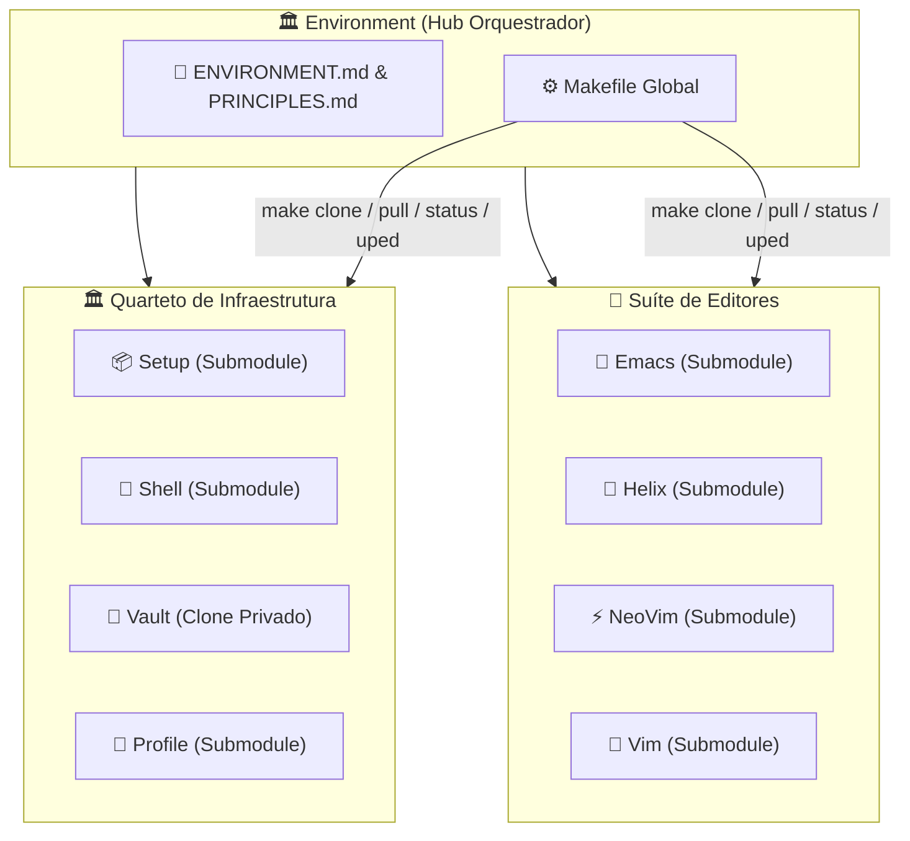

# 🏛️ Universal Environment

> Hub orquestrador do **Quarteto de Produtividade** — ponto de entrada unificado para provisionamento, personalização e operação de estações de trabalho em Linux, FreeBSD e Windows.

---

### 🏛️ O Quarteto de Infraestrutura

[](https://github.com/GabrielFrigo4/setup)
[](https://github.com/GabrielFrigo4/shell)
[](https://github.com/GabrielFrigo4/vault)
[](https://github.com/GabrielFrigo4/profile)

### 📝 A Suíte de Editores

[](https://github.com/GabrielFrigo4/emacs)
[](https://github.com/GabrielFrigo4/helix)
[](https://github.com/GabrielFrigo4/neovim)
[](https://github.com/GabrielFrigo4/vim)

> 📖 **Arquitetura Unificada do Ecossistema:** Conheça a matriz completa de responsabilidades, ciclo de boot e segregação de privilégios em [ENVIRONMENT.md](ENVIRONMENT.md).
> 📜 **Princípios de Engenharia:** Conheça os 18 princípios UNIX e boas práticas Clean Code em [PRINCIPLES.md](PRINCIPLES.md).

---

## 🧠 O que é o Environment?

O **Environment** é o **repositório raiz** que centraliza e orquestra os 4 componentes do Quarteto de Produtividade e os 4 repositórios da Suíte de Editores. Ele não é um monorepo — cada componente mantém seu próprio repositório Git independente. O Environment funciona como:

1. **Ponto de Entrada Único:** Clone este repositório e tenha acesso imediato a todo o ecossistema via `make clone`.
2. **Orquestrador de Operações:** Comandos globais (`make status`, `make pull`, `make uped`, `make audit`, `make ci`) operam simultaneamente em todo o ecossistema.
3. **Fonte Canônica de Documentação:** O [ENVIRONMENT.md](ENVIRONMENT.md) e [PRINCIPLES.md](PRINCIPLES.md) nesta raiz são as versões autoritativas do ecossistema.



---

## 📋 Arquitetura Híbrida (Submodules + Clone Privado)

| Repositório                                             | Tipo          | Visibilidade | Mecanismo                                     |
| :------------------------------------------------------ | :------------ | :----------- | :-------------------------------------------- |
| **[Setup](https://github.com/GabrielFrigo4/setup)**     | Git Submodule | 🟢 Público   | `git submodule update --init`                 |
| **[Shell](https://github.com/GabrielFrigo4/shell)**     | Git Submodule | 🟢 Público   | `git submodule update --init`                 |
| **[Profile](https://github.com/GabrielFrigo4/profile)** | Git Submodule | 🟢 Público   | `git submodule update --init`                 |
| **[Vault](https://github.com/GabrielFrigo4/vault)**     | Clone Privado | 🔴 Privado   | `git clone` via SSH (requer chave autorizada) |
| **[Emacs](https://github.com/GabrielFrigo4/emacs)**     | Git Submodule | 🟢 Público   | `git submodule update --init`                 |
| **[Helix](https://github.com/GabrielFrigo4/helix)**     | Git Submodule | 🟢 Público   | `git submodule update --init`                 |
| **[NeoVim](https://github.com/GabrielFrigo4/neovim)**   | Git Submodule | 🟢 Público   | `git submodule update --init`                 |
| **[Vim](https://github.com/GabrielFrigo4/vim)**         | Git Submodule | 🟢 Público   | `git submodule update --init`                 |

> 💡 **Setup**, **Shell**, **Profile** e os 4 repositórios da **Suíte de Editores** são submódulos públicos acessíveis a qualquer visitante. O **Vault** é um repositório privado clonado separadamente — visitantes sem acesso receberão um aviso amigável sem interromper a operação.

---

## 🚀 Instalação Rápida

### 📥 Clone Completo (com Submódulos)

```sh
git clone --recurse-submodules "https://github.com/GabrielFrigo4/environment"
cd environment
make clone
```

O `git clone --recurse-submodules` traz automaticamente os 3 repos públicos. O `make clone` tenta clonar o Vault via SSH (falha silenciosamente se não autorizado).

### 🔄 Atualizar Tudo

```sh
make pull
```

---

## ⚙️ Comandos do Makefile

| Comando        | Ação                                                       |
| :------------- | :--------------------------------------------------------- |
| `make clone`   | Inicializa submódulos públicos e clona o Vault (defensivo) |
| `make hooks`   | Configura `.githooks` executáveis em todos os repos        |
| `make status`  | Exibe status Git resumido dos 4 repositórios               |
| `make pull`    | Atualiza submódulos e puxa todos os repos                  |
| `make audit`   | Executa suites de auditoria estática e validação           |
| `make format`  | Formata todos os arquivos Markdown com Prettier            |
| `make lint-md` | Valida formatação de Markdown com Prettier                 |
| `make sync`    | Sincroniza dotfiles e skills de IA no sistema              |
| `make bench`   | Mede latência de inicialização de shells e módulos         |
| `make test`    | Valida sintaxe POSIX e Zsh em todos os scripts             |
| `make ci`      | Executa auditoria completa e quality gates locais          |
| `make doctor`  | Executa diagnóstico pós-boot do sistema                    |

---

## 📂 Estrutura do Repositório

```text
Environment/
├── Setup/          ← Submodule público (provisionamento de SO)
├── Shell/          ← Submodule público (motor de terminal)
├── Profile/        ← Submodule público (dotfiles & IA)
├── Vault/          ← Clone privado (segredos, .gitignored)
├── Makefile        ← Orquestrador global de operações
├── ENVIRONMENT.md  ← Manifesto canônico de arquitetura
├── PRINCIPLES.md   ← 18 Princípios de Engenharia
├── AGENTS.md       ← Briefing para agentes de IA
├── LICENSE         ← MIT License
└── .agents/        ← Skills e regras para IAs
```

---

## 🔗 Documentação Canônica

- 🏛️ **[ENVIRONMENT.md](ENVIRONMENT.md)**: Arquitetura federada, matriz de responsabilidades e ciclo de boot.
- 📜 **[PRINCIPLES.md](PRINCIPLES.md)**: Os 18 Princípios de Engenharia e Clean Code do ecossistema.
- 🤖 **[AGENTS.md](AGENTS.md)**: Guia de contexto para agentes de IA (Antigravity, Claude, GPT).
