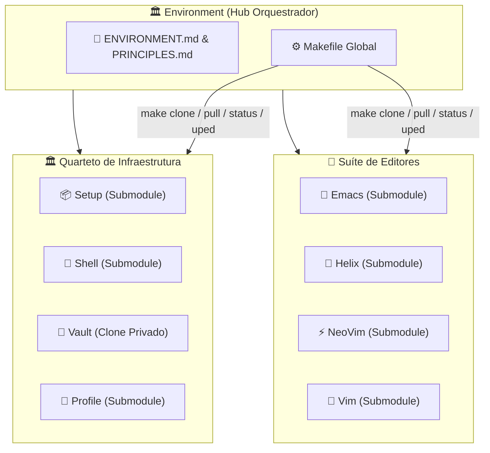

# 🏛️ Universal Environment

> Hub orquestrador do **Quarteto de Produtividade** — ponto de entrada unificado para provisionamento, personalização e operação de estações de trabalho em Linux, FreeBSD e Windows.

---

### 🏛️ O Quarteto de Infraestrutura

[](https://github.com/GabrielFrigo4/setup)
[](https://github.com/GabrielFrigo4/shell)
[](https://github.com/GabrielFrigo4/vault)
[](https://github.com/GabrielFrigo4/profile)

### 📝 A Suíte de Editores

[](https://github.com/GabrielFrigo4/emacs)
[](https://github.com/GabrielFrigo4/helix)
[](https://github.com/GabrielFrigo4/neovim)
[](https://github.com/GabrielFrigo4/vim)

### 🖥️ Plataformas Homologadas


-Supported-purple?logo=gitforwindows&logoColor=white>)

[](TODO.md)

> 📖 **Arquitetura Unificada do Ecossistema:** Conheça a matriz completa de responsabilidades, ciclo de boot e segregação de privilégios em [ENVIRONMENT.md](ENVIRONMENT.md).
> 📜 **Princípios de Engenharia:** Conheça os 18 princípios UNIX e boas práticas Clean Code em [PRINCIPLES.md](PRINCIPLES.md).
> 🗺️ **Roadmap & Status do Ecossistema:** Acompanhe o planejamento estratégico e a matriz de status em [TODO.md](TODO.md).

---

## 🧠 O que é o Environment?

O **Environment** é o **meta-repositório e hub orquestrador** que centraliza os 4 componentes do Quarteto de Produtividade e os 4 repositórios da Suíte de Editores. **Ele NÃO é um monorepo e NÃO é uma dependência runtime de produção**:

- **Em Produção (Descentralizado & Soberano):** O Environment **não precisa existir nem ser clonado**. Cada ferramenta (`Shell`, `Emacs`, `NeoVim`, `Profile`, `Vault`) é clonada diretamente em seu caminho canônico (`~/.config/profile`, `~/.vault`, `/usr/local/share/shell`, `~/.emacs.d`, `~/.config/nvim`, etc.) e opera de maneira 100% autônoma e desacoplada.
- **No Desenvolvimento (Hub do Arquiteto):** O Environment serve como o quartel-general de engenharia de Gabriel Frigo. Ele reúne os submódulos para permitir manutenção simultânea, auditoria cruzada (`make audit`), testes de sintaxe em lote (`make test`) e propagação da documentação canônica (`make sync-docs`).
- **O que é o `make bootstrap` (ou `./environment.sh clone`)?** É o orquestrador que clona e provisiona cada componente individual diretamente em suas posições canônicas nativas do sistema operacional, sem criar symlinks frágeis apontando para a pasta de desenvolvimento.
- **Axioma da Precedência Local sobre Global (Local > Global):** Em todo o ecossistema, o escopo mais específico prevalece: CLI > Variáveis de Ambiente (`$SHELL_REPO_DIR`, `$VAULT_DIR`, `$PROFILE_DIR`) > Projeto Local (`.agents/skills/`) > Usuário (`~/.config/profile`, `~/.vault`, `~/.gemini/config/skills/`) > Sistema Global (`/usr/local/share/`).



---

## 📋 Arquitetura Híbrida (Submodules + Clone Privado)

| Repositório                                             | Tipo          | Visibilidade | Mecanismo                                     |
| :------------------------------------------------------ | :------------ | :----------- | :-------------------------------------------- |
| **[Setup](https://github.com/GabrielFrigo4/setup)**     | Git Submodule | 🟢 Público   | `git submodule update --init`                 |
| **[Shell](https://github.com/GabrielFrigo4/shell)**     | Git Submodule | 🟢 Público   | `git submodule update --init`                 |
| **[Profile](https://github.com/GabrielFrigo4/profile)** | Git Submodule | 🟢 Público   | `git submodule update --init`                 |
| **[Vault](https://github.com/GabrielFrigo4/vault)**     | Clone Privado | 🔴 Privado   | `git clone` via SSH (requer chave autorizada) |
| **[Emacs](https://github.com/GabrielFrigo4/emacs)**     | Git Submodule | 🟢 Público   | `git submodule update --init`                 |
| **[Helix](https://github.com/GabrielFrigo4/helix)**     | Git Submodule | 🟢 Público   | `git submodule update --init`                 |
| **[NeoVim](https://github.com/GabrielFrigo4/neovim)**   | Git Submodule | 🟢 Público   | `git submodule update --init`                 |
| **[Vim](https://github.com/GabrielFrigo4/vim)**         | Git Submodule | 🟢 Público   | `git submodule update --init`                 |

> 💡 **Setup**, **Shell**, **Profile** e os 4 repositórios da **Suíte de Editores** são submódulos públicos acessíveis a qualquer visitante. O **Vault** é um repositório privado clonado separadamente — visitantes sem acesso receberão um aviso amigável sem interromper a operação.

---

## 🚀 Instalação Rápida & Autonomia Reentrante

### 🗺️ Matriz Global de Caminhos e Resolução do Ecossistema

| Localização Canônica          | Paradigma / Privilégios        |          Shell           |      Profile       |       Vault        | Casos de Uso & Filosofia                                                                       |
| :---------------------------- | :----------------------------- | :----------------------: | :----------------: | :----------------: | :--------------------------------------------------------------------------------------------- |
| **`/usr/local/share/<repo>`** | Global / FHS (`root` / `sudo`) | 🟢 **Padrão de Sistema** | ⚠️ Não Recomendado | 🚫 Não Recomendado | Paridade de login entre `root` e admin. Desaconselhado para dotfiles e proibido para segredos. |
| **`~/.local/share/<repo>`**   | XDG Data (Rootless)            |    ⭐ **Recomendado**    | ⭐ **Recomendado** | ⭐ **Recomendado** | Isolamento total de usuário, conformidade XDG e padrão limpo para Linux, BSDs, macOS e MSYS2.  |
| **`~/.config/<repo>`**        | XDG Config (Rootless)          |      🔵 Alternativa      |   🔵 Alternativa   |   🔵 Alternativa   | Centralização sob `~/.config` para usuários que agrupam configurações no mesmo diretório.      |
| **`~/.<repo>`**               | Home Direta (Clássico UNIX)    |    ⚪ Fallback Legado    | ⚪ Fallback Legado | ⚪ Fallback Legado | Compatibilidade tradicional para sistemas UNIX legados sem XDG ou dotdirs na raiz da `$HOME`.  |

---

### 📦 Modo 1: Instalação Individual (Projetos 100% Autônomos)

Cada módulo opera de forma totalmente independente e pode ser clonado isoladamente sem qualquer dependência obrigatória ou aviso de erro:

| Módulo      | Comando de Instalação Rápida (One-Liner)                                                                                                   | Destino Canônico                                                                    |
| :---------- | :----------------------------------------------------------------------------------------------------------------------------------------- | :---------------------------------------------------------------------------------- |
| **Shell**   | `git clone "https://github.com/GabrielFrigo4/shell" "${HOME}/.local/share/shell" && sh "${HOME}/.local/share/shell/install.sh --pure"`     | `~/.local/share/shell` (recomendado), `~/.config/shell` ou `/usr/local/share/shell` |
| **Profile** | `git clone "https://github.com/GabrielFrigo4/profile" "${HOME}/.local/share/profile" && sh "${HOME}/.local/share/profile/profile.sh sync"` | `~/.local/share/profile` (recomendado), `~/.config/profile` ou `~/.profile`         |
| **Emacs**   | `git clone "https://github.com/GabrielFrigo4/emacs" "${HOME}/.emacs.d"`                                                                    | `~/.emacs.d`                                                                        |
| **NeoVim**  | `git clone "https://github.com/GabrielFrigo4/neovim" "${HOME}/.config/nvim"`                                                               | `~/.config/nvim`                                                                    |
| **Helix**   | `git clone "https://github.com/GabrielFrigo4/helix" "${HOME}/.config/helix"`                                                               | `~/.config/helix`                                                                   |
| **Vim**     | `git clone "https://github.com/GabrielFrigo4/vim" "${HOME}/.vim" && ln -sf "${HOME}/.vim/vimrc" "${HOME}/.vimrc"`                          | `~/.vim` e `~/.vimrc` (ou `~/vimfiles` no Windows)                                  |
| **Vault**   | `git clone "git@github.com:GabrielFrigo4/vault" "${HOME}/.local/share/vault" && chmod 0700 "${HOME}/.local/share/vault"`                   | `~/.local/share/vault` (recomendado), `~/.config/vault` ou `~/.vault`               |

### 🏛️ Modo 2: Hub Central (Bancada de Desenvolvimento & Orquestração)

O repositório **Environment** (`~/Documents/Environment`) é estritamente uma **bancada de desenvolvimento e orquestração**. Absolutamente **nada** em seu diretório deve ser consumido diretamente pelo SO hospedeiro como runtime.

Para inicializar a bancada e em seguida provisionar todos os runtimes soberanos em seus caminhos canônicos no sistema operacional:

```sh
git clone --recurse-submodules "https://github.com/GabrielFrigo4/environment" "${HOME}/Documents/Environment"
cd "${HOME}/Documents/Environment"
make clone
make install
```

---

## ⚙️ Comandos do Makefile

| Comando          | Ação                                                                  |
| :--------------- | :-------------------------------------------------------------------- |
| `make clone`     | Inicializa submódulos de desenvolvimento e clona o Vault (defensivo)  |
| `make install`   | Clona e provisiona cada repositório soberano em seu caminho canônico  |
| `make bootstrap` | Alias para `make install` (conveniência e compatibilidade)            |
| `make deploy`    | Alias para `make install` (conveniência e compatibilidade)            |
| `make update`    | Atualiza todas as instalações soberanas no SO (Shell, Profile, etc.)  |
| `make pull`      | Atualiza submódulos e sincroniza todos os repos com o upstream        |
| `make sync-docs` | Propaga ENVIRONMENT.md e PRINCIPLES.md para todos os submódulos       |
| `make uped`      | Atualiza individualmente os 4 repositórios da Suíte de Editores       |
| `make upgit`     | Atualiza recursivamente todos os repositórios Git encontrados         |
| `make strip`     | Purga metadados (`.git*`, `*.md`) para modo Zero-Bloat                |
| `make status`    | Exibe status Git resumido de todo o ecossistema (Core + Editores)     |
| `make hooks`     | Configura `.githooks` executáveis em todos os repositórios            |
| `make audit`     | Executa suítes de auditoria estática e conformidade em todos os repos |
| `make test`      | Valida sintaxe POSIX, Zsh e headless em todos os scripts e editores   |
| `make bench`     | Mede latência de inicialização de shells e módulos (&lt; 64ms)        |
| `make doctor`    | Executa diagnóstico de integridade e sanity check pós-boot            |
| `make format`    | Formata todos os arquivos Markdown com Prettier                       |
| `make lint-md`   | Valida formatação de Markdown com Prettier sem alterar arquivos       |
| `make ci`        | Executa pipeline completa de testes, auditoria e pre-commit           |

---

## 📂 Estrutura do Repositório

```text
Environment/
├── Setup/          ← Submodule público (provisionamento de SO; setup.sh na raiz)
├── Shell/          ← Submodule público (motor de terminal; shell.sh na raiz)
├── Profile/        ← Submodule público (dotfiles, linters & IA; profile.sh na raiz)
├── Vault/          ← Clone privado (segredos criptografados; vault.sh na raiz)
├── Editor/
│   ├── Emacs/      ← Submodule público (GNU Emacs; emacs.sh na raiz)
│   ├── Helix/      ← Submodule público (Helix modal; helix.sh na raiz)
│   ├── NeoVim/     ← Submodule público (Neovim modular; neovim.sh na raiz)
│   └── Vim/        ← Submodule público (Vim clássico UNIX; vim.sh na raiz)
├── environment.sh  ← Interface CLI e orquestrador mestre do ecossistema
├── Makefile        ← Orquestrador global de automação
├── ENVIRONMENT.md  ← Manifesto canônico de arquitetura
├── PRINCIPLES.md   ← 19 Princípios de Engenharia
├── AGENTS.md       ← Briefing para agentes de IA
└── .agents/        ← Skills e regras operacionais para IAs
```

---

## 🔗 Documentação Canônica

- 🏛️ **[ENVIRONMENT.md](ENVIRONMENT.md)**: Arquitetura federada, matriz de responsabilidades e ciclo de boot.
- 📜 **[PRINCIPLES.md](PRINCIPLES.md)**: Os 19 Princípios de Engenharia e Clean Code do ecossistema.
- 🤖 **[AGENTS.md](AGENTS.md)**: Guia de contexto para agentes de IA (Antigravity, Claude, GPT).
